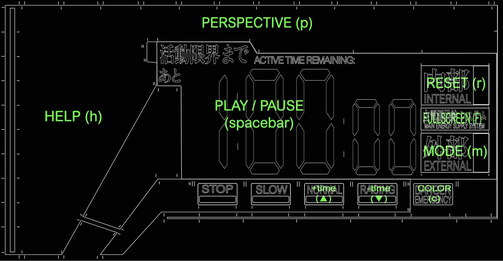
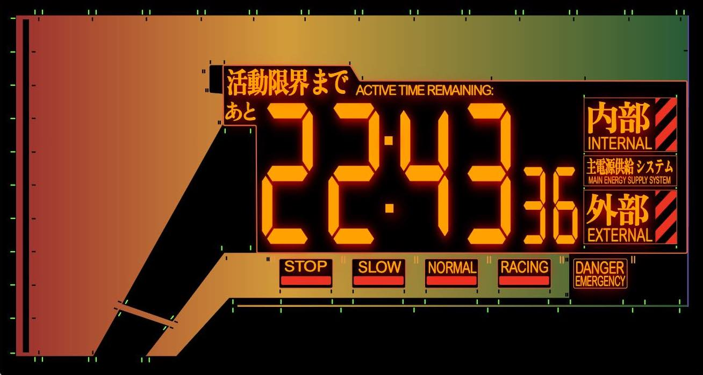

Evangelion Clock that runs on browsers.
[Try it here!](https://eva-clock.netlify.app/)
 
 

 

## Features
- [x] Run on browsers
- [x] Scalable vector graphics (try run this on a huge screen)
- [x] Support 3 modes: *Count Down*, *Count Up* and *System Time*
- [x] Can be installed as standalone app in Chrome (PWA)
- [ ] Customizable theme

## Guide
### User Interface
The following regions on the clock are clickable buttons:
 

### Keyboard Shortcuts
You can also use keyboard to control the clock:
- space - Play/Pause
- r - Reset time
- h - Show help
- m - Toggle clock modes
- ↑ - Add time
- ↓ - Deduct time
- p - Toggle perspective view
- f - Toggle fullscreen view (not support in iOS)
- c - Toggle colors/styples (not support in iOS)

### URL parameters
You can also configure the clock using URL parameters.

For examples, try:
  
> [`https://eva-clock.netlify.app/?play=1&total-sec=6&danger-sec=3`](https://eva-clock.netlify.app/?play=1&total-sec=6&danger-sec=3)

> The above URL will start a clock with 6 seconds count down and change to danger in the last 3 seconds.

Here is a list of configurable URL params: 

| URL Params | Possible Values | Description |
|---|---|---|
|`play`| 0, 1 | Auto Play on load|
|`mode`| `COUNTDOWN` `COUNTUP` `SYSTEMTIME` | Clock Mode |
|`perspective`| 0, 1 | Perspective View |
|`total-min` `total-sec` `total-ms` | integer | Total countdown/countup time|
|`danger-min` `danger-sec` `danger-ms` | integer | Time remains to change to danger|

### Progressive Web App
In Chrome, you can install this app as standalone web app. The "Install app" button is next to the address bar:
 

 

## Screenshots
| Function | Screenshot |
|---|---|
| Racing ||
| Danger ||
| Stop ||
| System Time ||
| Glowing Text ||
| Help ||
| Chrome App ||

