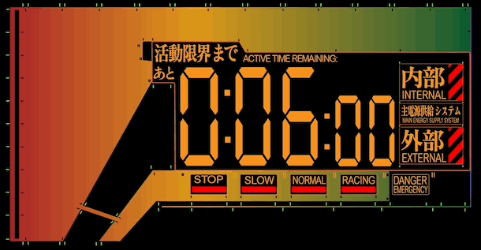
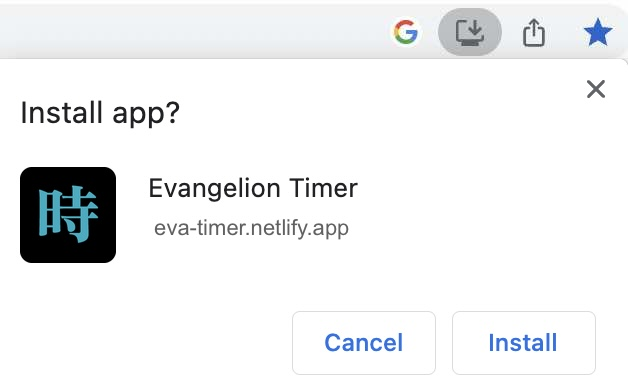
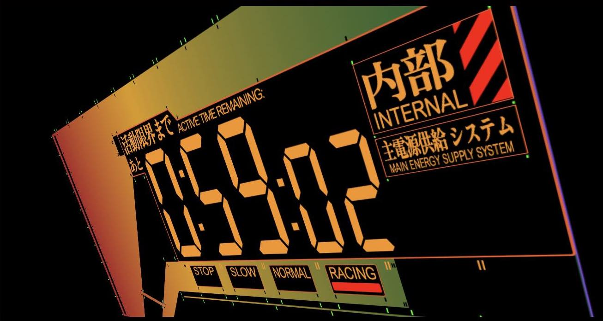
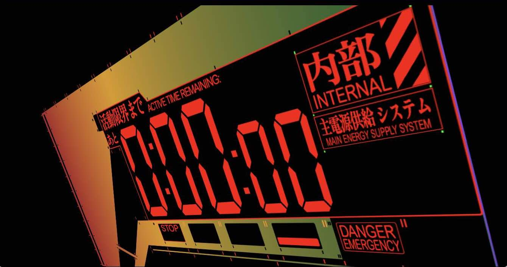
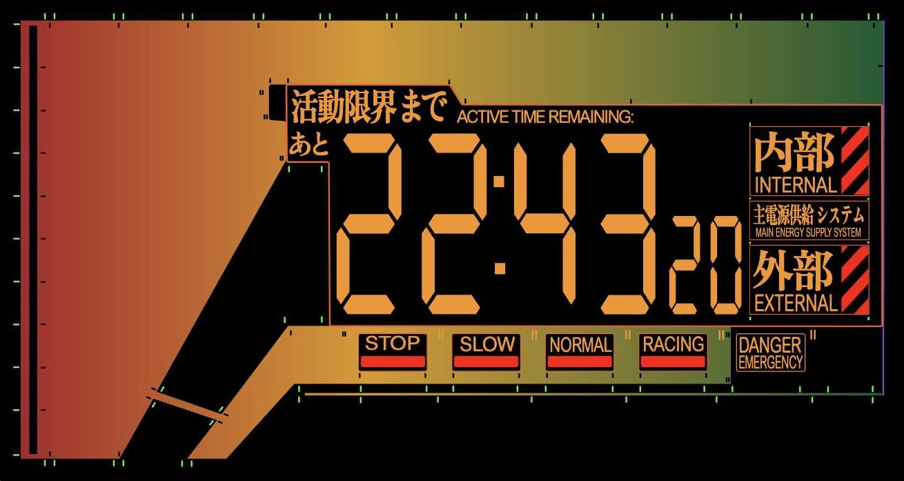
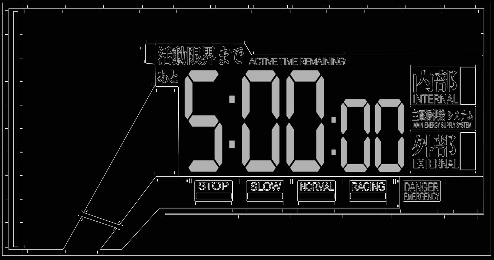
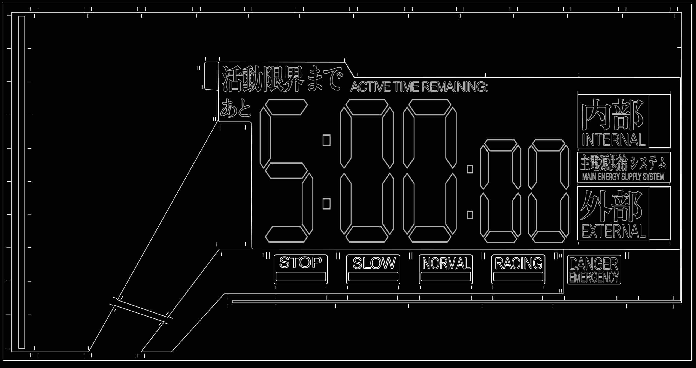
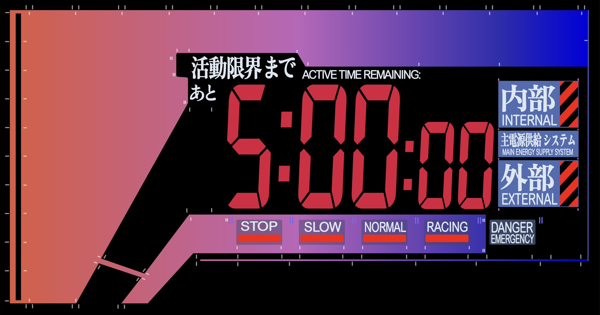
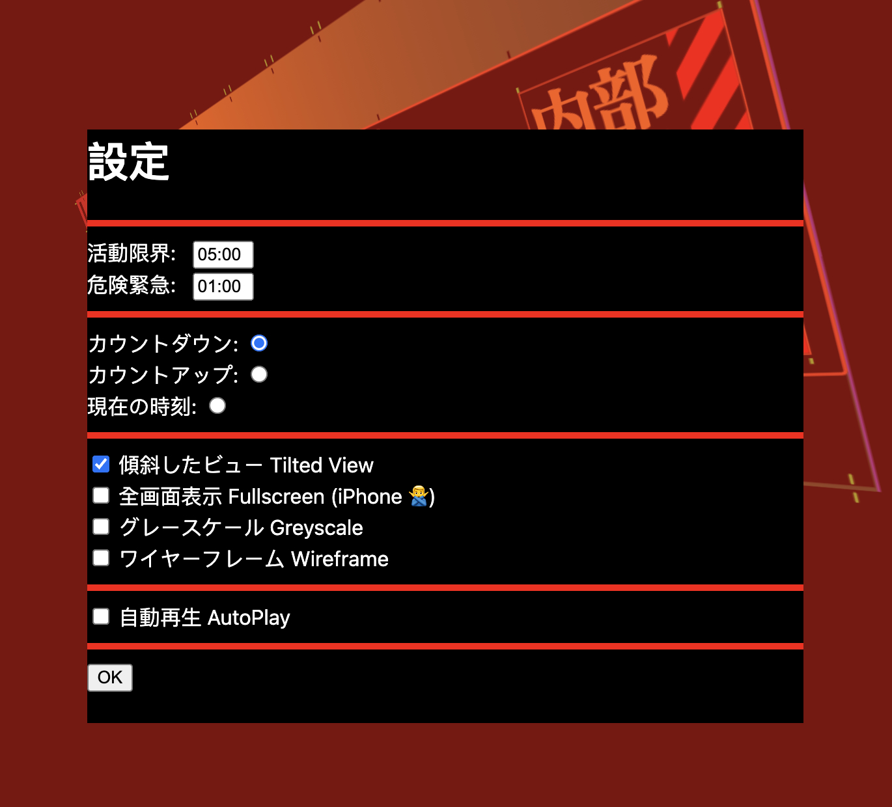
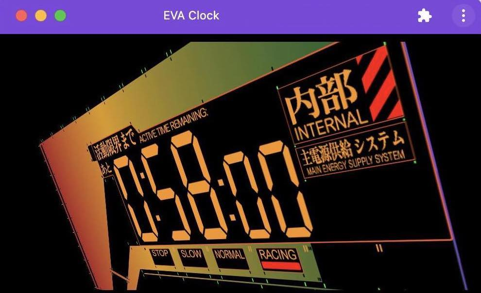

Evangelion timer that runs on browsers!

[Try the PyScript implementation here!](https://eva-timer.netlify.app/index-py.html)
 
 

 

## Features
- [x] Run on browsers using PyScript
- [ ] Run on browsers using Javascript [work in progress]
- [x] Scalable vector graphics
- [x] Support 3 modes: *Count Down*, *Count Up* and *System Time*
- [x] Support Settings
- [x] Support Progressive Web App (PWA)
- [ ] Support other themes, e.g. Rebuild of Evangelion [work in progress]

## User Guide
### GUI
Various regions on the GUI are clickable, please try it out and have fun!

### Keyboard Shortcuts
You can also use keyboard to control the timer:
- Spacebar - Play / Pause
- s - Settings
- r - Reset time / Toggle clock modes
- p - Toggle perspective view
- f - Toggle fullscreen view (not support in iOS)
- w - Toggle wireframe mode
- ↑ - Add time
- ↓ - Deduct time
- Esc - Exit fullscreen / Exit Settings

### URL parameters
You can configure the timer by launching it with URL parameters.

For examples, try:
 
> [`https://eva-timer.netlify.app/?autoplay=1&duration=6&emergency_duration=3`](https://eva-timer.netlify.app/?autoplay=1&duration=6&emergency_duration=3)

> The above URL will launch the EVA timer with 6 seconds count down and change to emergency in the last 3 seconds.

Here is a list of configurable URL params:

| URL Params | Possible Values | Description | Default |
|---|---|---|---|
|`autoplay`| 0 , 1 | Auto Play on load| 0 |
|`mode`| 0, 1, 2 | Timer mode: 0=countdown, 1=countup, 2=system time| 0 |
|`tilted`| 0, 1 | Tilted View or Flatten View | 1 |
|`fullscreen`| 0, 1 | Fullscreen mode | 0 |
|`duration` | integer | Total countdown/countup duration in seconds| 300 |
|`emergency_duration` | integer | Time remains in seconds to change to emergency| 60 |

### Progressive Web App
In Chrome, you can install this app as standalone web app. The "Install app" button is next to the address bar:
 

 

## Screenshots
| Function | Screenshot |
|---|---|
| Racing ||
| Danger ||
| Stop ||
| System Time |
| Greyscale ||
| Wireframe ||
| Rebuild ||
| Settings ||
| Install PWA||
| PWA on Chrome ||

## Documentations
See [docs](docs)

## Resources
See [eva-timer-analysis](https://github.com/scottykwok/eva-timer-analysis) for a list of the original timer designs.

## Changelog
[1.0.0](releases/tag/v1.0.0)
- This was the first implementation in plain Javascript.

[2.0.0](releases/tag/v2.0.0)
- This version has been refactored to support PyScript and Javascript
- Create `svgui.py` and `svgui.js` for better reusability
- The project will be presented in [PyCon APAC 2023 @ Tokyo, Japan](https://2023-apac.pycon.jp/timetable).
